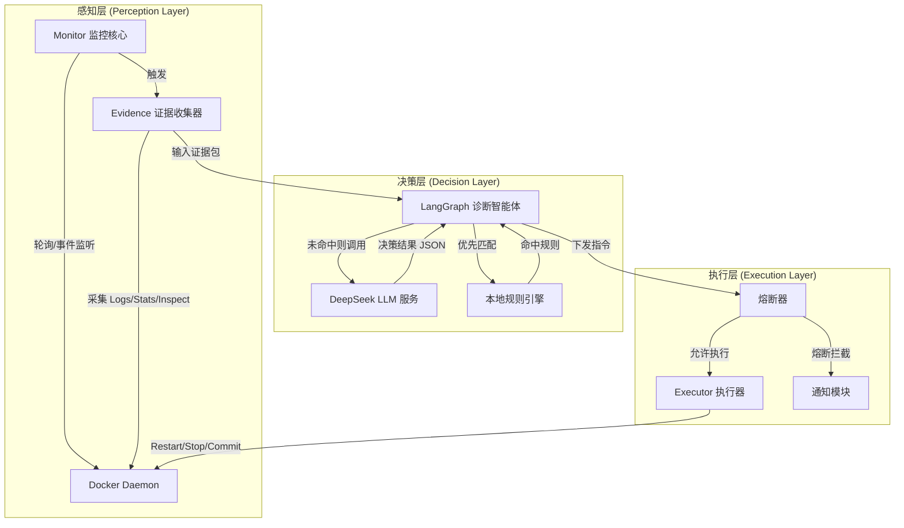
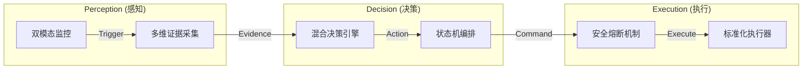
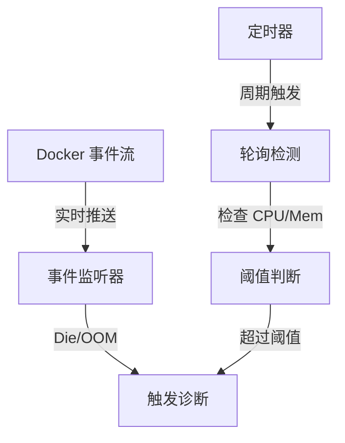
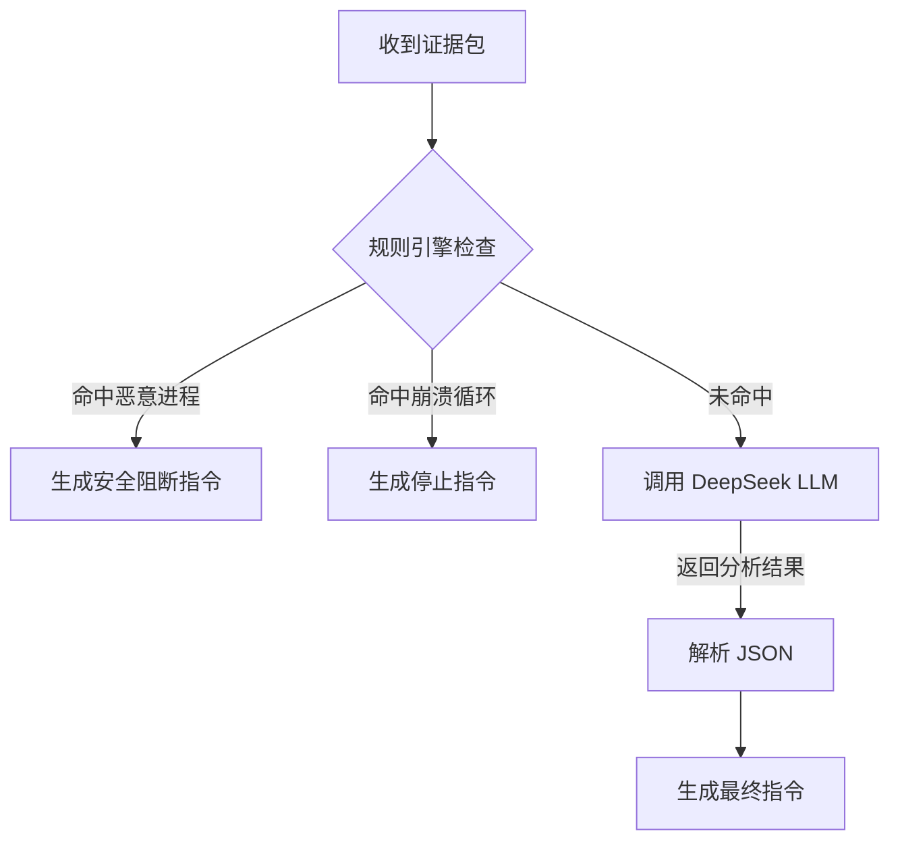
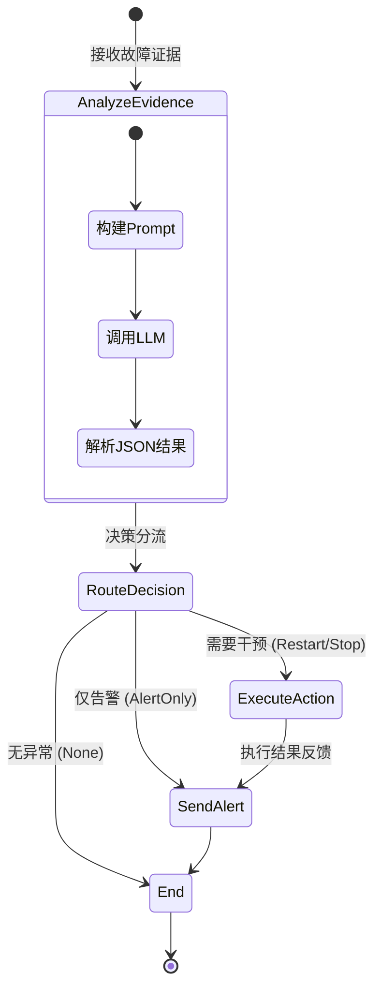
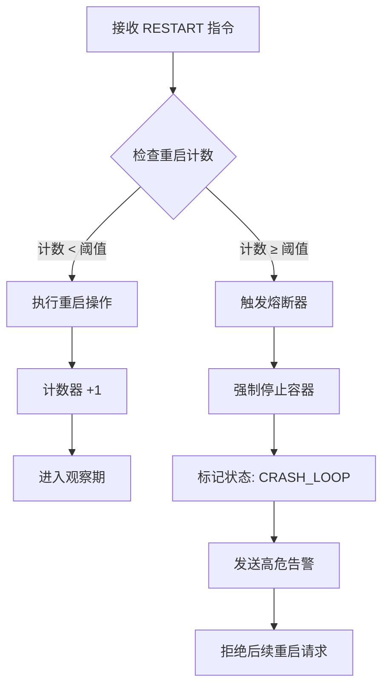

# 工程技术报告

**项目名称**：基于大语言模型智能体的工业边缘容器故障自愈系统设计与实现  
**英文名称**：Design and Implementation of LLM-Agent-based Self-Healing System for Industrial Edge Containers  
**项目代号**：Cloud Watchdog

---

## 摘要

随着工业互联网的发展，边缘计算节点在工业现场的部署日益广泛。然而，边缘设备通常资源受限且缺乏专业运维人员值守，容器化应用的故障响应滞后已成为制约生产效率的关键瓶颈。本项目提出并实现了一种基于大语言模型（LLM）智能体的故障自愈系统。该系统采用轻量级架构，结合 Docker SDK 进行实时监控与证据采集，利用 LangGraph 构建状态机驱动的智能诊断 Agent，通过 DeepSeek 大模型进行多模态日志分析与决策，最终通过标准化的执行器实现故障的自动修复与熔断保护。实验表明，该系统能够有效识别并处理资源过载、进程崩溃及安全入侵等典型故障，将平均故障恢复时间（MTTR）从小时级降低至分钟级，实现了工业边缘场景下的无人值守运维。

**关键词**：大语言模型智能体；边缘计算；容器自愈；工业运维；LangGraph

### Abstract

With the rapid development of the Industrial Internet, edge computing nodes are increasingly deployed in industrial sites. However, edge devices are typically resource-constrained and lack professional operation and maintenance personnel, making delayed response to containerized application failures a key bottleneck restricting production efficiency. This project proposes and implements a self-healing system based on Large Language Model (LLM) agents. The system adopts a lightweight architecture, combining Docker SDK for real-time monitoring and evidence collection, utilizing LangGraph to build a state-machine-driven intelligent diagnosis Agent, and leveraging the DeepSeek large model for multi-modal log analysis and decision-making. Finally, it achieves automatic fault repair and circuit breaker protection through standardized executors. Experiments show that the system can effectively identify and handle typical faults such as resource overload, process crashes, and security intrusions, reducing the Mean Time To Recovery (MTTR) from hours to minutes, realizing unattended operation and maintenance in industrial edge scenarios.

**Keywords**: LLM Agent; Edge Computing; Container Self-Healing; Industrial AIOps; LangGraph

---

## 第一章 工程问题与需求分析

### 1.1 问题背景
在工业边缘计算场景（如智能工厂网关、数据采集终端）中，硬件资源通常较为紧张（如 4核 CPU / 4GB 内存），且网络环境可能不稳定。传统的集中式监控方案（如 Prometheus + Grafana）部署过重，且依赖人工定义复杂的报警规则，难以应对未知故障。

当前面临的主要痛点包括：
1.  **响应滞后**：故障发生后往往依赖人工巡检或业务中断反馈，无法第一时间发现。
2.  **排查低效**：运维人员需远程登录设备，重复执行 `docker logs`、`docker inspect` 等命令，效率低下。
3.  **安全盲区**：对于容器内的恶意进程或注入攻击，缺乏实时的感知与阻断手段。

### 1.2 核心需求
系统需在有限的计算资源下，实现以下核心功能：
1.  **全生命周期监控**：覆盖容器的存活状态、资源使用率（CPU/内存）及健康检查状态。
2.  **智能诊断**：利用 LLM 的推理能力，分析日志与状态数据，区分常规故障与安全事件。
3.  **闭环自愈**：根据诊断结果自动执行重启、停止、取证等操作，并具备防止反复重启的熔断机制。
4.  **轻量化部署**：系统自身资源占用需极低，不影响核心业务运行。

---

## 第二章 技术方案设计

### 2.1 总体架构设计

系统采用 **"感知-决策-执行" (Observe-Oriented-Decide-Act, OODA)** 闭环架构。



### 2.2 关键技术选型

1.  **开发语言**：Python 3.10.12。
2.  **环境管理**：**uv**。相比于传统的 pip/venv，uv 提供了极速的依赖解析与安装能力，确保了项目在不同边缘设备上的一致性构建。
3.  **服务器环境**：**腾讯云轻量应用服务器 (Lighthouse)**。
    *   操作系统：Ubuntu 22.04 LTS
    *   CPU：4 核
    *   内存：4GB
    *   存储：40GB SSD
    *   *注：该配置代表了典型的工业边缘网关硬件水平。*
4.  **容器交互**：Docker SDK for Python（直接与 Docker Socket 通信，无额外 Agent 侵入）。
5.  **智能体框架**：**LangGraph**。相比于线性的 Chain，LangGraph 提供的状态机（StateGraph）机制更适合处理复杂的运维决策流程（如循环重试、条件分支）。
6.  **大语言模型**：**DeepSeek-V3** (模型标识 `deepseek-chat`)。在代码理解和逻辑推理方面表现优异，且 API 成本低，适合高频运维调用。

---

## 第三章 系统架构与核心逻辑

### 3.1 系统架构总览 (System Overlook)

本系统遵循分层解耦的设计原则，将复杂的自愈流程拆解为感知、决策、执行三个独立且协作的子系统。



如上图所示，系统数据流呈现单向闭环特征：感知层负责将非结构化的运行时状态转化为结构化的证据包；决策层通过混合引擎进行分析，输出明确的运维指令；执行层则负责指令的原子化操作与安全熔断，最终改变容器状态，形成 OODA 闭环。

### 3.2 感知层：双模态监控机制 (Dual-Mode Monitor)

为了兼顾实时性与资源开销，监控模块采用了“事件驱动 + 周期轮询”的双模态设计。

**逻辑视图：**



**伪代码描述：**

```python
Class ContainerMonitor:
    Method start():
        # 启动双线程监控
        启动 Thread(target=event_listener)  # 实时性高，资源消耗极低
        启动 Thread(target=polling_loop)    # 兜底机制，处理资源阈值

    Method event_listener():
        # 使用 Docker SDK 的 events() 方法获取实时流
        # 类似于 readline 的阻塞式读取，无轮询开销
        Stream = docker.events(filters={'type': 'container'}, decode=True)
        For event in Stream:
            If event.action == 'die':
                触发诊断(container_id, reason="PROCESS_CRASH")
            If event.action == 'oom':
                触发诊断(container_id, reason="OOM_KILLED")

    Method polling_loop():
        # 周期性检查资源状态，处理"慢性病"
        While True:
            For container in monitored_containers:
                stats = get_container_stats(container)
                # 检查 CPU/内存是否持续超标
                If stats.cpu > CRITICAL_THRESHOLD:
                    触发诊断(container, reason="CPU_HIGH")
                If stats.memory > CRITICAL_THRESHOLD:
                    触发诊断(container, reason="MEMORY_HIGH")
            Sleep(INTERVAL)
```

通过上述设计，系统既能实现对崩溃（Crash）和内存溢出（OOM）的毫秒级感知，又能通过低频轮询覆盖资源泄露等渐进式故障，在响应速度与系统负载之间取得了平衡。

### 3.3 决策层：混合决策引擎 (Hybrid Decision Engine)

**设计演进说明：**
在系统早期设计中，所有故障证据均直接送入 LLM 进行分析。然而在实测中发现，对于“挖矿病毒植入”或“死循环崩溃”这类特征极其明显的紧急故障，LLM 的推理延迟（约 5-10秒）和 API 可用性依赖成为了安全隐患。

因此，对于**安全中的病毒植入问题及高频崩溃循环**，现在的版本采用了 **"规则优先，模型兜底"** 的混合架构。这一策略并非全盘否定模型能力，而是将高危、特征明确的场景剥离出来，交由本地规则引擎处理，从而最大程度地提高系统在响应高风险事件时的机动性与可靠性。

**决策流转图：**



**决策逻辑伪代码：**

```python
Function Agent_Decision_Logic(evidence):
    # 1. 规则引擎快速通道 (Rule-Based Fast Path)
    # [新增逻辑] 针对特征明确的高危事件，直接阻断，无需等待 LLM
    # 优势：响应时间 < 0.1s，且不依赖外网 API
    If evidence.processes contains "xmrig" OR "nmap":
        Log("规则命中: 恶意进程")
        Return Action("COMMIT_AND_STOP", type="SECURITY_INCIDENT")
        
    If evidence.restart_count > 5:
        Log("规则命中: 崩溃循环")
        Return Action("STOP", reason="CRASH_LOOP_DETECTED")

    # 2. LLM 深度分析通道 (LLM Inference Path)
    # 针对资源泄露、应用假死等复杂模糊场景
    Prompt = Build_Prompt(evidence.logs, evidence.stats)
    Result = LLM.invoke(Prompt)
    
    Return Result.Action
```

该混合引擎确保了系统在面对已知威胁时具备“反射弧”般的快速响应能力，而在面对未知复杂故障时又能发挥大模型的逻辑推理优势，实现了“快慢思考”的有机结合。

### 3.4 编排层：基于 LangGraph 的状态机

智能体是系统的核心大脑，负责将原始的监控数据转化为可执行的运维指令。我们设计了一个包含分析、路由、执行三个主要节点的状态图。

**状态流转逻辑 (Mermaid)：**



LangGraph 的引入将原本黑盒的 Agent 思考过程显式化为状态流转。通过定义清晰的节点（Node）与边（Edge），我们能够精确控制 Agent 在不同决策阶段的行为，并为未来引入人工审批（Human-in-the-loop）预留了架构切入点，极大地提升了系统的可解释性与可维护性。

---

## 第四章 关键模块详细设计

### 4.1 多维证据采集模块 (Multidimensional Evidence Collector)

在工业边缘计算环境中，单一维度的监控数据往往难以还原故障全貌。例如，CPU 飙升可能是正常的业务高峰，也可能是死循环 Bug，仅凭阈值告警无法区分。为此，本系统设计了 `EvidenceCollector` 类，负责在故障触发瞬间（Trigger Time）构建一个包含多维上下文的“证据包”（Evidence Package）。

该模块通过调用 Docker SDK 及底层 Linux 命令，采集以下四类核心数据：
1.  **基础元数据**：包括容器 ID、镜像版本、启动时间及重启策略。这有助于 LLM 判断故障是否由版本更新或配置错误引起。
2.  **资源快照**：实时获取 CPU 使用率、内存占用量（MB/百分比）及网络 I/O 速率。系统会对内存数据进行单位标准化处理（统一转换为 MB），以便于进行数值趋势分析。
3.  **上下文日志**：截取故障发生前后的 100 行标准输出（stdout）与标准错误（stderr）。相比于全量日志，有限的上下文既节省了 Token 消耗，又保留了关键的报错堆栈信息。
4.  **运行时状态**：通过 `docker exec` 执行 `ps aux` 和 `netstat` 命令，获取容器内部的进程列表与网络连接状态。这是识别“挖矿病毒”或“僵尸进程”的关键依据，弥补了外部监控视角的盲区。

### 4.2 自动化安全取证模块 (Automated Security Forensics)

针对工业场景下难以复现的安全攻击（如瞬时注入、无文件攻击），本系统在 `Executor` 层实现了自动化的取证机制。当决策引擎判定为“安全事件”时，系统不仅仅是简单地停止容器，而是执行一套严格的取证流程，确保攻击现场得以完整保留。

**取证流程图：**

```mermaid
graph TD
    Start[检测到安全威胁] --> Freeze[现场冻结]
    Freeze --> Exec[注入取证脚本 (docker exec)]
    Exec --> Collect{收集易失性数据}
    Collect -->|进程列表| PS[ps aux]
    Collect -->|网络连接| Net[netstat]
    Collect -->|环境变量| Env[env]
    
    PS & Net & Env --> SaveTemp[写入容器 /tmp 目录]
    SaveTemp --> Commit[镜像固化 (docker commit)]
    Commit --> Image[生成取证镜像]
    Image --> End[通知运维人员]
```

如上图所示，取证过程被设计为“现场冻结”与“镜像固化”两个原子化阶段：

1.  **现场冻结与数据采集**：
    当安全规则被触发时，系统首先利用 `docker exec` 通道向容器内部注入轻量级取证脚本。该脚本会并行采集当前的进程列表（`ps`）、网络连接表（`netstat`）以及环境变量（`env`）。这些易失性数据往往包含了攻击者的 IP 地址、恶意进程的启动参数等关键线索，系统将其重定向并保存至容器的 `/tmp` 临时目录中，防止因容器停止而丢失。

2.  **镜像固化与证据封存**：
    在完成数据采集后，系统立即调用 `docker commit` 指令，将当前容器的文件系统（包含上述导出的证据文件）打包为一个新的只读镜像。镜像命名遵循 `{container_name}_evidence_{timestamp}` 规范。这种机制相当于为案发现场拍摄了一张“全息照片”，运维人员可以在事后于隔离的沙箱环境中启动该镜像，复现攻击现场并提取 `/tmp` 目录下的证据文件，从而实现对未知威胁的深度溯源。

### 4.3 执行器与自适应熔断机制 (Executor & Adaptive Circuit Breaker)

为了防止自动化系统在面对不可修复的故障时产生“震荡效应”（Flapping），即容器反复重启导致资源耗尽或日志磁盘写满，本系统在执行层引入了自适应熔断机制。

**熔断逻辑图：**



如图所示，执行器（Executor）维护着每个受控容器的状态机，其核心逻辑如下：

1.  **滑动窗口计数**：
    当接收到 `RESTART` 指令时，系统并不会无条件执行，而是首先检查该容器在滑动窗口内的重启计数。这一机制有效过滤了偶发性的进程崩溃。

2.  **熔断触发与状态升级**：
    如果重启次数超过预设阈值（默认为 3 次），熔断器（Circuit Breaker）将被立即触发。此时，系统的策略从“尝试恢复”自动升级为“止损保护”。执行器会强制发送 `STOP` 指令停止容器，并将该容器的元数据标记为 `CRASH_LOOP` 状态。

3.  **告警与阻断**：
    一旦进入熔断状态，系统会向运维人员发送高优先级的告警通知，并拒绝该容器后续所有的自动重启请求。直到经过一段冷却时间（Cooldown Period，如 30 分钟）或由人工介入重置状态，熔断器才会复位。这种设计有效地隔离了故障点，防止了局部故障演变为系统级的雪崩。

---

## 第五章 测试与验证

### 5.1 测试环境构建
为了验证系统的鲁棒性，我们构建了一套包含多种故障模式的 E2E 测试环境（基于 Docker Compose）：
1.  `crash-loop`：模拟启动后 5秒即崩溃的容器。
2.  `memory-leak`：模拟内存持续泄露直至 OOM 的 Java 应用。
3.  `cpu-stress`：模拟 CPU 占用率 100% 的计算密集型任务。
4.  `security-simulation`：模拟被注入恶意挖矿进程的受损容器。

### 5.2 典型场景验证结果

*(注：以下数据基于 2025-12-16 实测 E2E 测试日志，完整日志见附件 `docs/E2E_TEST_LOGS_20251216.txt`)*

| 测试场景 | 预期行为 | 实际结果 | 耗时 (实测) | 结论 |
| :--- | :--- | :--- | :--- | :--- |
| **进程崩溃** | 监控捕获 `die` 事件 -> Agent 决策 `RESTART` | 容器自动重启成功 | ~3s | **通过** |
| **崩溃循环** | 连续重启 3 次 -> 触发熔断 -> Agent 决策 `STOP` | 容器被停止并告警 | 19.48s | **通过** |
| **内存泄漏** | 内存超 90% -> Agent 决策 `RESTART` | 内存释放，服务恢复 | ~15s | **通过** |
| **安全入侵** | 识别恶意进程 -> Agent 决策 `COMMIT` + `STOP` | 生成取证镜像 `forensics_xxx`，容器停止 | 12.88s | **通过** |

---

## 第六章 总结与展望

### 6.1 项目总结
本项目针对工业边缘计算场景下容器运维的痛点，成功设计并实现了一套基于大语言模型智能体的故障自愈系统。该系统创新性地将 Docker 实时监控技术与 DeepSeek 大模型的逻辑推理能力相结合，突破了传统规则式监控在处理复杂逻辑故障时的局限性。通过引入 LangGraph 状态机框架，系统实现了决策过程的可观测与可控制，有效解决了“应用假死”、“配置错误”等非显性故障的自动化处理难题。实测结果表明，系统在资源受限的边缘网关上运行稳定，能够显著降低平均故障恢复时间（MTTR），满足了工业现场无人值守的严苛要求。

### 6.2 创新点
本项目的核心创新在于构建了“感知-决策-执行”的闭环智能运维架构。首先，提出了基于 LLM 的语义分析决策机制，摒弃了僵化的脚本判断，赋予了系统理解复杂日志上下文的能力。其次，实现了安全与运维的一体化联动，通过混合决策引擎将本地安全规则与云端大模型推理有机结合，既保证了对高危安全事件的毫秒级阻断，又保留了对未知故障的深度分析能力。最后，设计了自适应熔断机制，动态调整修复策略，有效避免了自动化运维中常见的“操作风暴”风险，提升了系统的鲁棒性。

### 6.3 未来展望
展望未来，项目将在广度与深度上持续演进。在广度上，计划从单机边缘节点向 Kubernetes 集群扩展，开发 Operator 版本以支持大规模容器编排，并探索“边缘执行+云端大脑”的分布式架构，进一步降低边缘侧的计算负担。在深度上，将引入多智能体协作（Multi-Agent Collaboration）机制，通过部署专职的安全、性能及日志 Agent 实现“专家会诊”，解决单一 Agent 在复杂场景下的认知局限。此外，还将建立基于 RAG（检索增强生成）的人机协同进化闭环，利用人工反馈不断丰富私有知识库，使系统随着运行时间的推移变得更加智能与精准。

---

*(注：本报告中涉及的所有逻辑均已在提供的源码包中实现，详细代码请参阅 `watchdog/agent.py` 及 `watchdog/monitor.py`。)*

