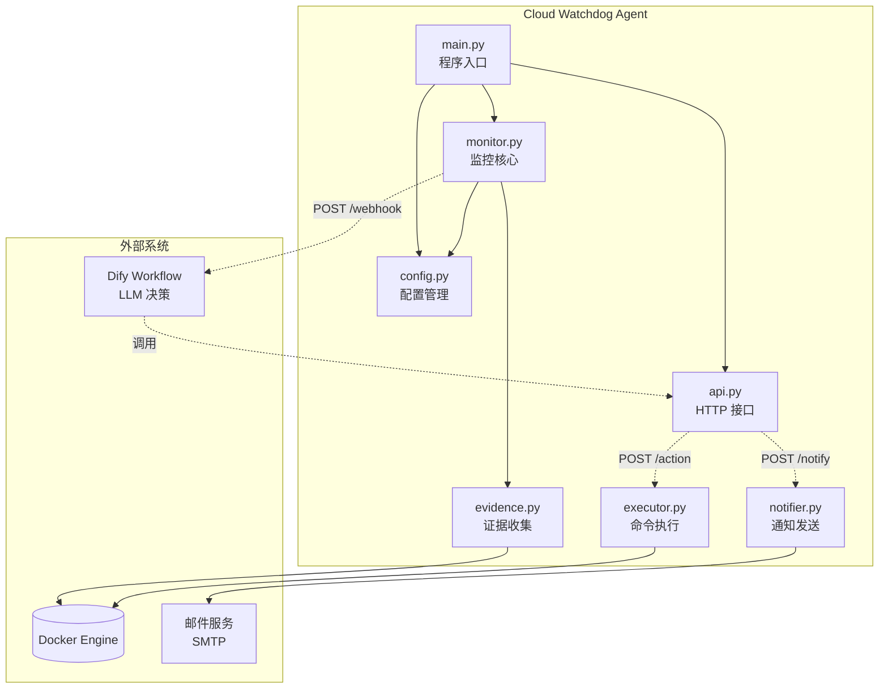
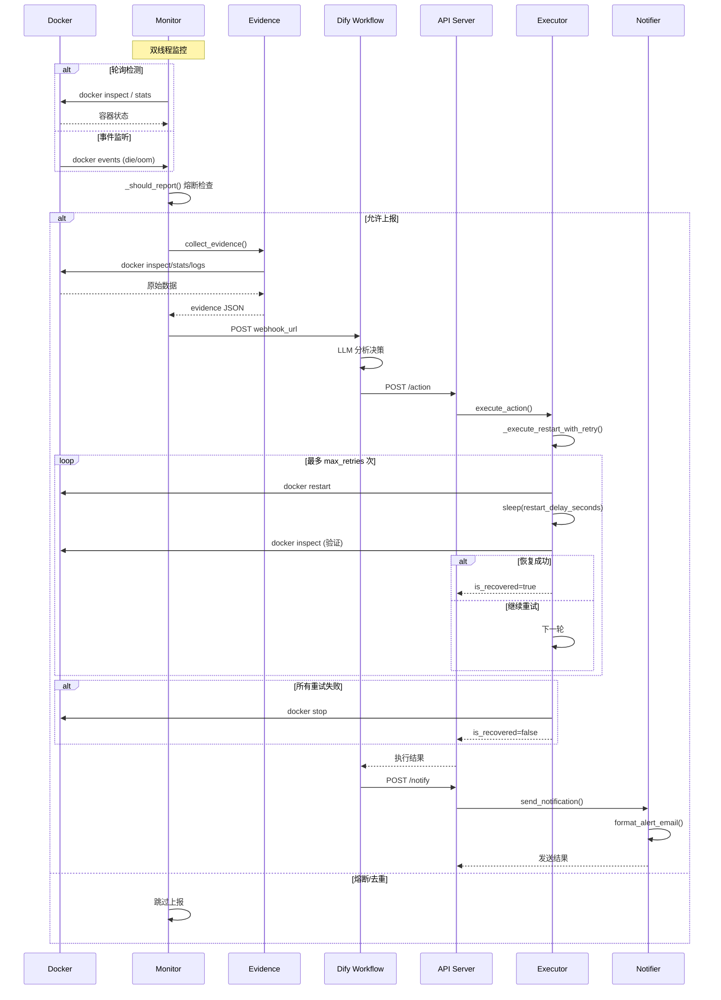
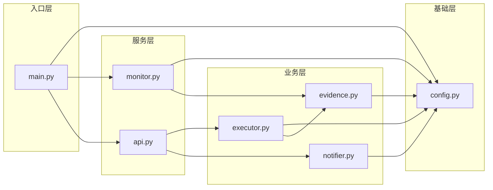
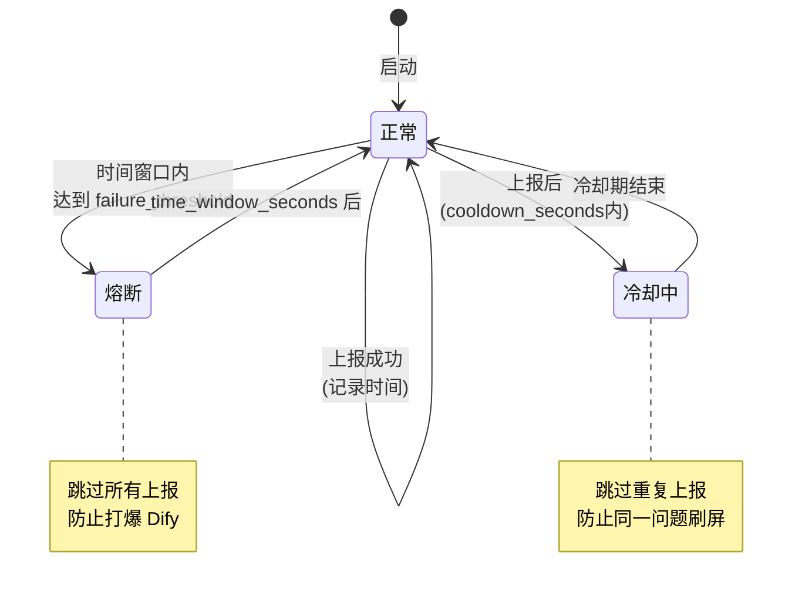
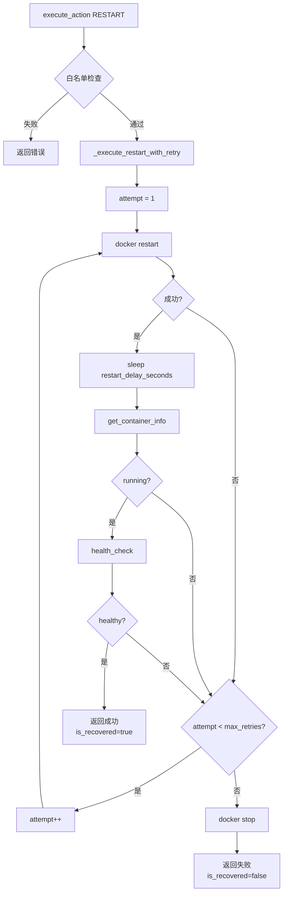
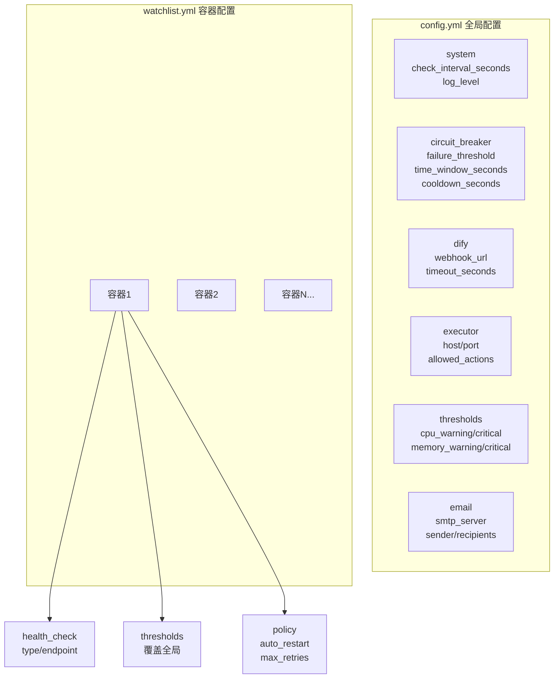
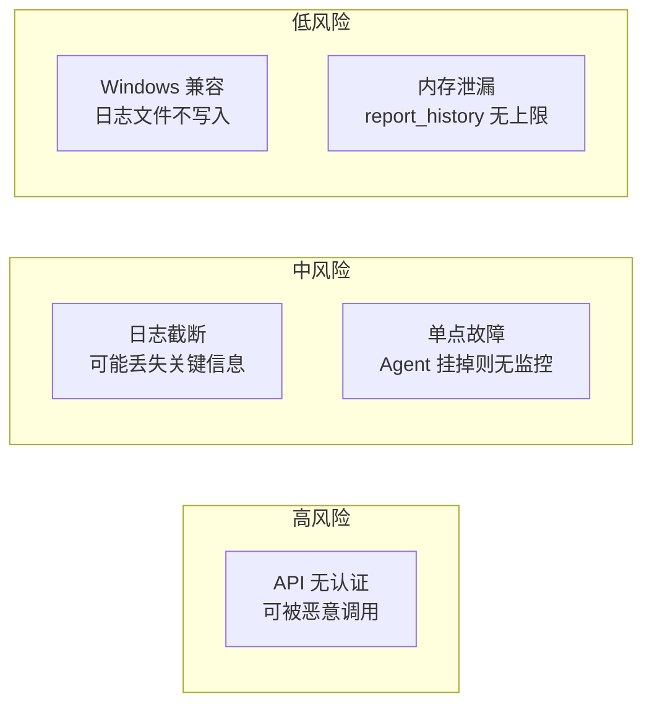
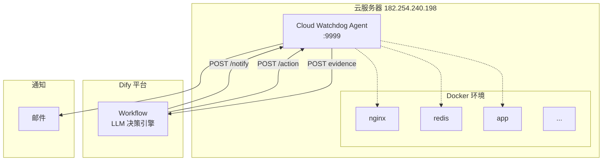

# Cloud Watchdog 项目评估报告

> 评估时间：2024-12-03

---

## 1. 系统架构图

---

## 2. 核心数据流

---

## 3. 模块依赖关系

---

## 4. 熔断状态机

---

## 5. RESTART 重试流程

---

## 6. 配置层级

---

## 7. 项目评估

### 7.1 架构评估

| 维度 | 评分 | 说明 |
|------|------|------|
| **模块划分** | ⭐⭐⭐⭐ | 职责清晰，单一职责原则 |
| **依赖方向** | ⭐⭐⭐⭐ | 从上到下，无循环依赖 |
| **可测试性** | ⭐⭐⭐ | 缺少单元测试，但结构支持测试 |
| **可扩展性** | ⭐⭐⭐⭐ | 易于添加新的通知渠道、健康检查类型 |
| **错误处理** | ⭐⭐⭐ | 有基本处理，但异常类型不够细化 |

### 7.2 功能完整性

| 功能 | 状态 | 说明 |
|------|------|------|
| 容器存活监控 | ✅ 完整 | 轮询 + 事件监听双模式 |
| 资源监控 | ✅ 完整 | CPU/内存阈值检测 |
| 健康检查 | ✅ 完整 | HTTP/TCP/Command 三种类型 |
| 证据收集 | ✅ 完整 | inspect/stats/logs/health |
| 重试机制 | ✅ 完整 | 可配置重试次数和延迟 |
| 熔断保护 | ✅ 完整 | 时间窗口 + 阈值 + 冷却 |
| 邮件通知 | ✅ 完整 | 4种通知类型 |
| 飞书/钉钉通知 | ❌ 未实现 | 仅预留配置 |
| API 认证 | ❌ 未实现 | 接口完全开放 |

### 7.3 代码质量

| 指标 | 评价 |
|------|------|
| **代码行数** | ~1000 行（合理） |
| **注释覆盖** | 中等（函数有 docstring，内部注释少） |
| **类型标注** | 良好（使用 typing） |
| **配置外置** | 良好（YAML 配置） |
| **日志规范** | 良好（分级日志） |

### 7.4 潜在风险

### 7.5 改进建议

| 优先级 | 建议 | 工作量 |
|--------|------|--------|
| P0 | API 添加 IP 白名单认证 | 小 |
| P1 | 添加单元测试 | 中 |
| P1 | report_history 定期清理 | 小 |
| P2 | 飞书/钉钉通知实现 | 中 |
| P2 | 日志收集到文件 | 小 |
| P3 | 容器组 CPU 贡献度计算 | 中 |
| P3 | Web 管理界面 | 大 |

---

## 8. 部署架构

---

## 9. 总结

**项目成熟度：70%**

✅ 核心功能完整
✅ 架构设计合理
✅ 可扩展性良好

⚠️ 缺少测试覆盖
⚠️ API 安全性待加强
⚠️ 部分配置功能未使用

**可直接用于生产环境（需先添加 API 认证）**
